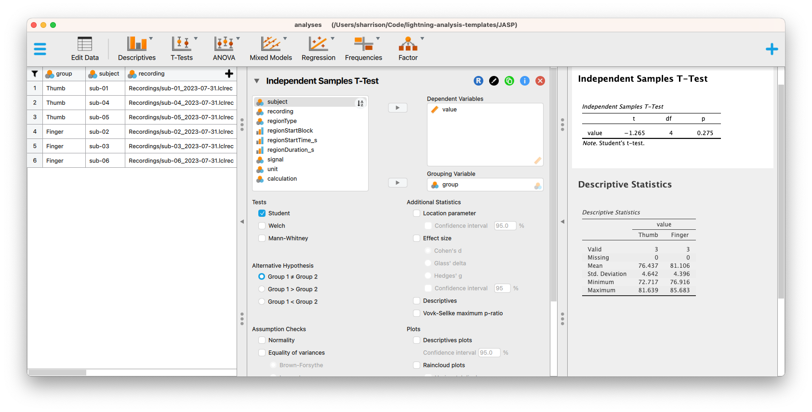

# JASP: Analyses of table data from LabChart Lightning

The `analyses.jasp` shows how to extract simple descriptive statistics and run
a t-test using JASP and the `simple_raw.csv` file. This was created with JASP
v0.19.1.

